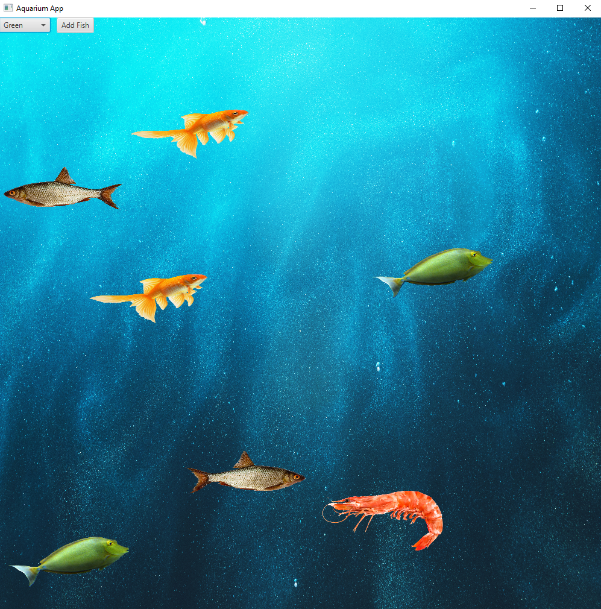

<header>

# Aquarium Project

## About

This is a Java Based aquarium application to demonstrate how to use OOP principles, for example, abstract and inheritance.
In this aquarium, you can add different types of fish, and they will swim around the aquarium. You can add as many fish as you want, and you can add different types of fish. The fish will swim around the aquarium, and they will change direction when they hit the wall. The fish will also change direction when it is clicked.
Either you can add fish by clicking on the aquarium, or you can add fish by clicking on the Add button. For each new type of fish, you need to specify their file name, original direction, and speed. The speed is a number between 1 and 100, where 1 is the slowest and 100 is the fastest. The original direction is either left or right. The file name is the name of the image file that will be used to display the fish. The image file must be in the resources folder.

## Implementation:
The project is implemented using JavaFX, which is a Java library used to build desktop applications. It has a set of graphics control, e.g. buttons and animations that this project is using.

Use of OOP principles can be seen in the following classes: 
- Resource.java 
- Fish.java 
- All Fish classes 
- FishFactory.java 
- AquariumApp.java 
- SetupUI.java 

<footer>

---

&copy; 2023 Ahmed Osman &bull; [Code of Conduct](https://www.contributor-covenant.org/version/2/1/code_of_conduct/code_of_conduct.md) &bull; [MIT License](https://gh.io/mit)

</footer>
